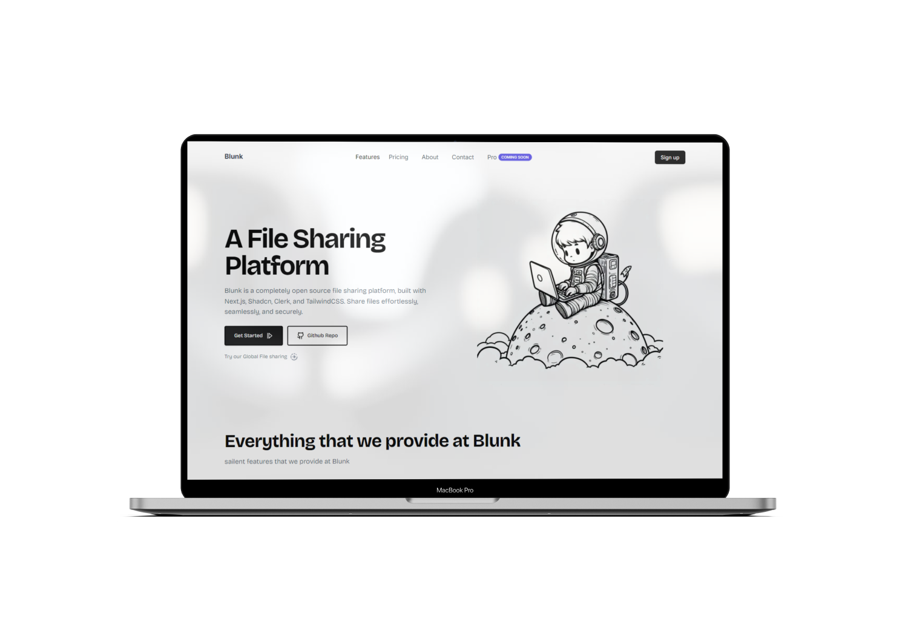

# Blunk
Blunk is a modern, cloud-based file management system built with Next.js, Convex, and Clerk. It provides a seamless experience for users to upload, organize, and share files within their organizations.



## Features
- 🚀 Fast and responsive file management
- 🔐 Secure authentication with Clerk
- 📁 Organize files with favorites and trash
- 👥 Team collaboration with organization support
- 📊 File type filtering and search functionality
- 🖼️ Image preview for supported file types
- 📱 Responsive design for desktop and mobile

## Tech Stack
- Next.js - React framework for building user interfaces
- Convex - Backend-as-a-Service for real-time data sync
- Clerk - Authentication and user management
- Tailwind CSS - Utility-first CSS framework
- Radix UI - Unstyled, accessible UI components
- TypeScript - Typed superset of JavaScript


## Getting Started

#### Clone the repository:

``` Bash
git clone https://github.com/yourusername/blunk.git
cd blunk
```

#### Install dependencies:
``` Bash
npm install
```

#### Set up environment variables:
Create a .env.local file in the root directory and add the following variables:
``` Bash
NEXT_PUBLIC_CONVEX_URL=<your-convex-url>
NEXT_PUBLIC_CONVEX_TOKEN=<your-convex-token>
NEXT_PUBLIC_CLERK_PUBLISHABLE_KEY=<your-clerk-publishable-key>
NEXT_PUBLIC_CLERK_SECRET_KEY=<your-clerk-secret-key>
```

#### Run the development server:
``` Bash
npm run dev
```

#### Open http://localhost:3000 with your browser to see the result.

## Contributing
Contributions are welcome! Please feel free to submit a Pull Request.


## License
This project is licensed under the MIT License.